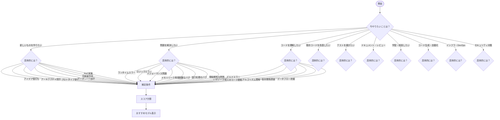

# GitHub Copilot モデル選択ナビゲーター — 仕様書

> **バージョン:** 1.0.0  
> **作成日:** 2026-02-25  
> **プロジェクト名:** Copilot Model Navigator

---

## 目次

1. [プロジェクト概要](#1-プロジェクト概要)
2. [ケーススタディ一覧](#2-ケーススタディ一覧)
3. [GitHub Copilot 選択可能モデルと特徴](#3-github-copilot-選択可能モデルと特徴)
4. [チャートフロー設計](#4-チャートフロー設計)
5. [モデル推薦ロジック](#5-モデル推薦ロジック)
6. [最新データ取得・ロジック更新機能](#6-最新データ取得ロジック更新機能)
7. [システムアーキテクチャ](#7-システムアーキテクチャ)
8. [画面設計](#8-画面設計)
9. [データ構造設計](#9-データ構造設計)
10. [Docker 構成](#10-docker-構成)
11. [技術スタック](#11-技術スタック)
12. [非機能要件](#12-非機能要件)

---

## 1. プロジェクト概要

### 1.1 背景

GitHub Copilot では複数の AI モデルを選択できるが、モデルによって消費クレジット・応答速度・得手不得手が異なる。ユーザーは「今やりたいこと」に対してどのモデルを選ぶべきか判断に迷うことが多い。

### 1.2 目的

開発者が「今何をしたいか」をチャート形式の質問に答えていくだけで、最適な GitHub Copilot モデルを推薦してくれる **社内向け Web サービス** を構築する。

**運用環境:**

- 社内向けツールとして各開発者のローカル環境で稼働
- Google AI Pro アカウント（全社員付与）の Gemini API を活用
- Docker Compose のみで起動可能

### 1.3 主要機能

| #    | 機能                              | 説明                                                                   |
| ---- | --------------------------------- | ---------------------------------------------------------------------- |
| F-01 | チャート式モデル診断              | 質問に回答していくと最適モデルを推薦                                   |
| F-02 | モデル詳細情報表示                | 推薦理由・モデル特徴・コスト比較を表示                                 |
| F-03 | 最新データ取得・ロジック更新      | Gemini API で最新モデル情報を取得しロジックを自動更新                  |
| F-04 | 診断結果の共有                    | 結果を URL やスクリーンショットで共有                                  |
| F-05 | 診断履歴                          | ローカルストレージに過去の診断結果を保持                               |
| F-06 | Gemini モデル選択・レート制限表示 | データ更新時に使用する Gemini モデルを選択可能、API レート制限を可視化 |

### 1.4 機能詳細: F-06 Gemini モデル選択・レート制限表示

#### 概要

データ更新時に使用する Gemini モデルを UI 上で選択でき、各モデルのレート制限をリアルタイムで確認できる機能。

#### 主要機能

1. **モデル選択**
    - データ更新ボタン押下時にモデル選択ダイアログを表示
    - 4つの Gemini モデルから選択可能 (2.5-pro, 2.0-flash-exp, 1.5-pro, 1.5-flash)
    - 各モデルの性能・速度・コスト・推奨用途を表示

2. **レート制限の可視化**
    - RPM (Requests Per Minute): 1分あたりのリクエスト数
    - TPM (Tokens Per Minute): 1分あたりのトークン数
    - TPD (Tokens Per Day): 1日あたりのトークン数
    - プログレスバーで使用率を視覚的に表示
    - ステータスアイコン（✅ 利用可能 / ⚠️ 制限接近中 / 🚫 制限到達）

3. **設定画面**
    - 全モデルのレート制限を一覧表示
    - API キーの検証機能
    - デフォルトモデルの設定
    - レート制限情報の手動更新

4. **インテリジェントな選択支援**
    - 制限到達中のモデルは選択不可
    - 制限接近中のモデルには警告表示
    - 各モデルの推奨用途を表示して選択をサポート

#### ユーザー体験

```
1. ユーザーが「最新データを取得」をクリック
   ↓
2. モデル選択ダイアログが開く
   - 各モデルのレート制限がリアルタイム表示
   - gemini-2.5-pro: ✅ 利用可能 (45/60 RPM)
   - gemini-1.5-pro: 🚫 制限到達 (60/60 RPM)
   ↓
3. ユーザーが利用可能なモデルを選択
   ↓
4. 選択したモデルでデータ更新を実行
   - 進行状況と使用トークン数を表示
```

#### 技術的実装

- バックエンドで Gemini API のレスポンスヘッダーからレート制限情報を取得
- Redis で1分間キャッシュ（レート制限のリセット周期に合わせる）
- WebSocket または Polling でフロントエンドに通知
- 設定画面では60秒ごとに自動更新

---

## 2. ケーススタディ一覧

開発者が AI（GitHub Copilot）に相談するケースを網羅的に洗い出す。

### 2.1 大分類

| ID   | 大分類カテゴリ            | 説明                                           |
| ---- | ------------------------- | ---------------------------------------------- |
| C-01 | 🆕 新規開発（0→1）        | ゼロから新しいサービス・機能・プロダクトを作る |
| C-02 | 🐛 バグ修正・デバッグ     | 既存コードの不具合を調査・修正する             |
| C-03 | 📖 コード理解・仕様把握   | 既存コードベースや仕様を読み解く               |
| C-04 | 🔧 リファクタリング・改善 | 既存コードの品質・構造を改善する               |
| C-05 | 🧪 テスト                 | テストコードの作成・テスト戦略の策定           |
| C-06 | 📝 ドキュメント           | 各種ドキュメントの作成・更新                   |
| C-07 | 👀 コードレビュー         | コードの品質チェック・レビュー支援             |
| C-08 | 📚 学習・教育             | 新しい技術の学習や概念の理解                   |
| C-09 | 🏗️ DevOps・インフラ       | CI/CD、コンテナ、IaC 等のインフラ構築          |
| C-10 | 📊 データ処理・分析       | データ変換、SQL、ETL、分析処理                 |
| C-11 | 🔒 セキュリティ           | セキュリティ対策・監査・脆弱性対応             |
| C-12 | 🎨 フロントエンド開発     | UI/UX 実装、スタイリング、レスポンシブ対応     |
| C-13 | 🔌 API 開発・連携         | API の設計・実装・外部サービス連携             |
| C-14 | 🗄️ データベース設計・操作 | スキーマ設計、クエリ最適化、マイグレーション   |
| C-15 | 🔀 移行・マイグレーション | 言語/FW/クラウド等の移行作業                   |
| C-16 | ⚡ コード生成・自動化     | ボイラープレート生成、定型処理自動化           |
| C-17 | 🛠️ トラブルシューティング | 環境構築・ビルド・デプロイの問題解決           |
| C-18 | 💬 設計相談・壁打ち       | アーキテクチャやアプローチの相談               |
| C-19 | 🔤 正規表現・文字列処理   | Regex 作成、データフォーマット変換             |
| C-20 | 🌐 Git・バージョン管理    | コンフリクト解消、ブランチ戦略                 |

### 2.2 詳細ケース一覧

#### C-01: 新規開発（0→1）

| ID      | ケース                           | 具体例                                           | 複雑度 |
| ------- | -------------------------------- | ------------------------------------------------ | ------ |
| C-01-01 | 新サービスの企画・アイデア壁打ち | 「こういう課題を解決するサービスを考えたい」     | 高     |
| C-01-02 | アーキテクチャ設計               | マイクロサービス構成、DB選定、技術スタック選定   | 高     |
| C-01-03 | 技術選定の相談                   | 「ReactとVueどちらが良いか」                     | 中     |
| C-01-04 | プロトタイプ・MVP開発            | 最小限の機能でとりあえず動くものを作る           | 中〜高 |
| C-01-05 | 新機能の設計と実装               | 既存サービスに新しい機能を追加                   | 中〜高 |
| C-01-06 | データモデル・DBスキーマ設計     | テーブル設計、ER図、正規化                       | 中     |
| C-01-07 | UI/UXデザインのコード化          | デザインカンプからのコーディング                 | 中     |
| C-01-08 | 初期環境構築                     | プロジェクトのセットアップ、ボイラープレート生成 | 低〜中 |
| C-01-09 | 仕様書・要件定義の作成           | 機能仕様書、画面仕様書の作成                     | 中〜高 |
| C-01-10 | PoC（概念実証）の実施            | 技術的実現可能性の検証                           | 中〜高 |

#### C-02: バグ修正・デバッグ

| ID      | ケース                             | 具体例                                                  | 複雑度 |
| ------- | ---------------------------------- | ------------------------------------------------------- | ------ |
| C-02-01 | ランタイムエラーの原因調査         | 「TypeError: Cannot read property of undefined が出る」 | 低〜中 |
| C-02-02 | ロジックエラーの特定と修正         | 計算結果が期待と異なる、条件分岐が正しくない            | 中     |
| C-02-03 | パフォーマンス問題の診断           | ページの読み込みが遅い、APIレスポンスが遅い             | 中〜高 |
| C-02-04 | メモリリーク調査                   | メモリ使用量が増え続ける                                | 高     |
| C-02-05 | 再現困難なバグの調査               | 特定条件でのみ発生する不具合                            | 高     |
| C-02-06 | 環境依存バグの調査                 | 特定のOS・ブラウザでのみ発生                            | 中     |
| C-02-07 | 並行処理・非同期処理のバグ         | レースコンディション、デッドロック                      | 高     |
| C-02-08 | サードパーティライブラリ起因のバグ | ライブラリアップデート後の不具合                        | 中     |
| C-02-09 | データ不整合の調査                 | DBのデータが期待と異なる状態になっている                | 中〜高 |
| C-02-10 | エラーログの解析                   | スタックトレースの読み解き                              | 低〜中 |

#### C-03: コード理解・仕様把握

| ID      | ケース                           | 具体例                                      | 複雑度 |
| ------- | -------------------------------- | ------------------------------------------- | ------ |
| C-03-01 | 既存コードベースの全体構造把握   | 新規参画時にプロジェクトを理解              | 中〜高 |
| C-03-02 | レガシーコードの解読             | ドキュメントがないコードの理解              | 高     |
| C-03-03 | 他人が書いたコードの理解         | PR レビュー前の理解、引き継ぎ               | 中     |
| C-03-04 | 複雑なアルゴリズムの理解         | 再帰、動的計画法、グラフ探索等              | 中〜高 |
| C-03-05 | サードパーティライブラリの使い方 | 初めて使うライブラリの使い方を知りたい      | 低〜中 |
| C-03-06 | 依存関係・影響範囲の把握         | あるコードを変更した場合の影響調査          | 中     |
| C-03-07 | ビジネスロジックの理解           | コードに埋め込まれた業務ロジックの解読      | 中〜高 |
| C-03-08 | 設定ファイル・環境変数の理解     | 複雑な設定の意味を把握                      | 低     |
| C-03-09 | データフローの把握               | データがシステム内をどう流れるか            | 中〜高 |
| C-03-10 | API仕様の把握                    | エンドポイント、リクエスト/レスポンスの理解 | 低〜中 |

#### C-04: リファクタリング・改善

| ID      | ケース                  | 具体例                                | 複雑度 |
| ------- | ----------------------- | ------------------------------------- | ------ |
| C-04-01 | コード品質改善          | 可読性向上、命名改善、コメント追加    | 低〜中 |
| C-04-02 | パフォーマンス最適化    | N+1解消、キャッシュ導入、クエリ最適化 | 中〜高 |
| C-04-03 | デザインパターンの適用  | Strategy, Observer, Factory等の導入   | 中     |
| C-04-04 | 技術的負債の解消        | TODO/FIXME の解消、非推奨APIの置換    | 中     |
| C-04-05 | コードの共通化（DRY化） | 重複コードの抽出、共通関数化          | 低〜中 |
| C-04-06 | アーキテクチャ変更      | モノリス→マイクロサービス分割等       | 高     |
| C-04-07 | 型付けの強化            | JavaScript→TypeScript化、型定義追加   | 中     |
| C-04-08 | エラーハンドリング改善  | try-catch整備、エラー境界の実装       | 低〜中 |
| C-04-09 | ログ・監視の改善        | 構造化ログの導入、メトリクス追加      | 低〜中 |
| C-04-10 | アクセシビリティ改善    | WCAG準拠、スクリーンリーダー対応      | 中     |

#### C-05: テスト

| ID      | ケース                       | 具体例                                 | 複雑度 |
| ------- | ---------------------------- | -------------------------------------- | ------ |
| C-05-01 | ユニットテスト作成           | 関数・メソッド単位のテスト             | 低〜中 |
| C-05-02 | インテグレーションテスト作成 | API結合テスト、DB連携テスト            | 中     |
| C-05-03 | E2Eテスト作成                | Playwright, Cypress等によるUIテスト    | 中〜高 |
| C-05-04 | テストケースの網羅性改善     | エッジケース、異常系のテスト追加       | 中     |
| C-05-05 | テストデータ生成             | Faker等を使ったモックデータ作成        | 低     |
| C-05-06 | テスト戦略の策定             | テストピラミッド、カバレッジ目標の設計 | 中     |
| C-05-07 | モック・スタブの作成         | 外部依存をモック化                     | 低〜中 |
| C-05-08 | パフォーマンステスト設計     | 負荷テスト、ベンチマークの設計         | 中〜高 |
| C-05-09 | テストのリファクタリング     | テストコードの整理・保守性改善         | 低〜中 |
| C-05-10 | テスト環境構築               | テストフレームワークのセットアップ     | 低     |

#### C-06: ドキュメント

| ID      | ケース                                  | 具体例                               | 複雑度 |
| ------- | --------------------------------------- | ------------------------------------ | ------ |
| C-06-01 | コードコメント・Docstring作成           | 関数やクラスのドキュメント           | 低     |
| C-06-02 | APIドキュメント生成                     | OpenAPI/Swagger仕様の作成            | 低〜中 |
| C-06-03 | README作成                              | プロジェクトの概要・使い方の記述     | 低     |
| C-06-04 | 技術仕様書作成                          | アーキテクチャ設計書、機能仕様書     | 中〜高 |
| C-06-05 | 運用マニュアル作成                      | デプロイ手順、障害対応手順           | 中     |
| C-06-06 | リリースノート作成                      | CHANGELOG、バージョン別変更点        | 低     |
| C-06-07 | チュートリアル・ガイド作成              | 新規メンバー向けオンボーディング資料 | 中     |
| C-06-08 | ADR（Architecture Decision Record）作成 | 技術的意思決定の記録                 | 中     |
| C-06-09 | 図表・ダイアグラム作成                  | Mermaid、PlantUMLでのシーケンス図等  | 中     |
| C-06-10 | 多言語ドキュメント対応                  | i18n、翻訳                           | 低〜中 |

#### C-07: コードレビュー

| ID      | ケース                       | 具体例                            | 複雑度 |
| ------- | ---------------------------- | --------------------------------- | ------ |
| C-07-01 | PRレビュー支援               | 差分コードの品質チェック          | 中     |
| C-07-02 | セキュリティ脆弱性検出       | SQLインジェクション、XSS等        | 中〜高 |
| C-07-03 | ベストプラクティスチェック   | SOLID原則、Clean Code準拠         | 中     |
| C-07-04 | コーディング規約準拠チェック | ESLint, Prettier 等の規約チェック | 低     |
| C-07-05 | パフォーマンスレビュー       | N+1、不要な再レンダリング等の検出 | 中〜高 |
| C-07-06 | テスト十分性の確認           | テストが十分かどうかの評価        | 中     |

#### C-08: 学習・教育

| ID      | ケース                         | 具体例                           | 複雑度 |
| ------- | ------------------------------ | -------------------------------- | ------ |
| C-08-01 | 新しい言語の学習               | Rust, Go, Kotlin等の基礎習得     | 中     |
| C-08-02 | 新しいフレームワークの学習     | Next.js, FastAPI, Spring Boot等  | 中     |
| C-08-03 | デザインパターンの理解         | GoF、DDD、CQRS等の概念理解       | 中     |
| C-08-04 | ベストプラクティスの学習       | 各技術のベストプラクティスを知る | 低〜中 |
| C-08-05 | サンプルコード生成             | 特定技術のサンプル実装           | 低     |
| C-08-06 | 技術的概念の説明               | 「イベント駆動とは何か」等       | 低〜中 |
| C-08-07 | アルゴリズム・データ構造の学習 | ソートアルゴリズム、木構造等     | 中〜高 |
| C-08-08 | クラウドサービスの学習         | AWS, GCP, Azure の各サービス     | 中     |
| C-08-09 | 資格試験対策                   | 技術系資格の学習支援             | 中     |

#### C-09: DevOps・インフラ

| ID      | ケース                        | 具体例                                 | 複雑度 |
| ------- | ----------------------------- | -------------------------------------- | ------ |
| C-09-01 | CI/CDパイプライン構築         | GitHub Actions, GitLab CI 設定         | 中     |
| C-09-02 | Docker設定                    | Dockerfile, docker-compose.yml 作成    | 低〜中 |
| C-09-03 | Kubernetes設定                | マニフェスト作成、ヘルムチャート       | 中〜高 |
| C-09-04 | IaC（Infrastructure as Code） | Terraform, CloudFormation, Pulumi      | 中〜高 |
| C-09-05 | デプロイ自動化                | デプロイスクリプト、Blue/Greenデプロイ | 中     |
| C-09-06 | モニタリング・アラート設定    | Prometheus, Grafana, Datadog           | 中     |
| C-09-07 | SSL/TLS証明書設定             | Let's Encrypt, 証明書更新自動化        | 低〜中 |
| C-09-08 | ネットワーク設定              | DNS, ロードバランサー, VPN             | 中     |

#### C-10: データ処理・分析

| ID      | ケース                   | 具体例                               | 複雑度 |
| ------- | ------------------------ | ------------------------------------ | ------ |
| C-10-01 | データ変換スクリプト作成 | JSON→CSV変換、データクレンジング     | 低〜中 |
| C-10-02 | SQLクエリ作成・最適化    | 複雑なJOIN、サブクエリ、実行計画改善 | 低〜高 |
| C-10-03 | データマイグレーション   | DB間データ移行、スキーマ変更         | 中〜高 |
| C-10-04 | ETLパイプライン作成      | 抽出→変換→ロードの自動化             | 中〜高 |
| C-10-05 | データ分析・可視化       | 統計処理、グラフ生成                 | 中     |
| C-10-06 | バッチ処理の実装         | 定期実行ジョブ、大量データ処理       | 中     |
| C-10-07 | データバリデーション     | 入力値検証、データ整合性チェック     | 低〜中 |

#### C-11: セキュリティ

| ID      | ケース                         | 具体例                             | 複雑度 |
| ------- | ------------------------------ | ---------------------------------- | ------ |
| C-11-01 | セキュリティ監査               | OWASP Top 10 準拠チェック          | 中〜高 |
| C-11-02 | 脆弱性評価・修正               | 依存ライブラリの脆弱性対応         | 中     |
| C-11-03 | 認証・認可実装                 | OAuth2, JWT, RBAC の実装           | 中〜高 |
| C-11-04 | 暗号化処理実装                 | データ暗号化、ハッシュ化           | 中     |
| C-11-05 | CORS/CSP設定                   | セキュリティヘッダーの設定         | 低     |
| C-11-06 | 入力バリデーション・サニタイズ | XSS, SQLインジェクション防止       | 低〜中 |
| C-11-07 | セキュリティテスト作成         | ペネトレーションテストのスクリプト | 中〜高 |

#### C-12: フロントエンド開発

| ID      | ケース                         | 具体例                             | 複雑度 |
| ------- | ------------------------------ | ---------------------------------- | ------ |
| C-12-01 | UIコンポーネント作成           | React/Vue コンポーネント実装       | 低〜中 |
| C-12-02 | CSS/スタイリング               | レイアウト、テーマ、アニメーション | 低〜中 |
| C-12-03 | レスポンシブデザイン           | モバイル対応レイアウト             | 低〜中 |
| C-12-04 | 状態管理の設計・実装           | Redux, Zustand, Pinia等の実装      | 中     |
| C-12-05 | フォーム処理                   | バリデーション、エラーハンドリング | 低〜中 |
| C-12-06 | アニメーション・トランジション | Framer Motion, CSS アニメーション  | 中     |
| C-12-07 | パフォーマンス最適化           | Core Web Vitals 改善、遅延読み込み | 中〜高 |
| C-12-08 | アクセシビリティ実装           | ARIA属性、キーボードナビゲーション | 中     |

#### C-13: API開発・連携

| ID      | ケース              | 具体例                             | 複雑度 |
| ------- | ------------------- | ---------------------------------- | ------ |
| C-13-01 | REST API設計・実装  | エンドポイント設計、CRUD API実装   | 中     |
| C-13-02 | GraphQL設計・実装   | スキーマ設計、リゾルバー実装       | 中〜高 |
| C-13-03 | 外部API連携         | サードパーティAPIとの統合          | 低〜中 |
| C-13-04 | WebSocket実装       | リアルタイム通信                   | 中     |
| C-13-05 | APIバージョニング   | 後方互換性を保つAPI進化            | 中     |
| C-13-06 | API認証・レート制限 | APIキー、トークン管理、throttling  | 中     |
| C-13-07 | gRPC実装            | Protocol Buffers定義、サービス実装 | 中〜高 |

#### C-14: データベース設計・操作

| ID      | ケース                         | 具体例                                 | 複雑度 |
| ------- | ------------------------------ | -------------------------------------- | ------ |
| C-14-01 | スキーマ設計                   | テーブル設計、正規化、インデックス設計 | 中     |
| C-14-02 | クエリ最適化                   | スロークエリ改善、実行計画分析         | 中〜高 |
| C-14-03 | マイグレーションスクリプト作成 | スキーマ変更のマイグレーション         | 低〜中 |
| C-14-04 | ORM設定・カスタマイズ          | Prisma, TypeORM, SQLAlchemy等          | 中     |
| C-14-05 | NoSQL設計                      | MongoDB, DynamoDB スキーマ設計         | 中     |
| C-14-06 | データ整合性の確保             | 外部キー、制約、トランザクション       | 中     |

#### C-15: 移行・マイグレーション

| ID      | ケース                    | 具体例                             | 複雑度 |
| ------- | ------------------------- | ---------------------------------- | ------ |
| C-15-01 | 言語間の移行              | JavaScript → TypeScript            | 中〜高 |
| C-15-02 | フレームワーク移行        | Vue 2 → Vue 3, Angular → React     | 高     |
| C-15-03 | クラウド移行              | AWS → GCP, オンプレ → クラウド     | 高     |
| C-15-04 | DBマイグレーション        | MySQL → PostgreSQL                 | 中〜高 |
| C-15-05 | ライブラリ移行            | Moment.js → Day.js, Webpack → Vite | 中     |
| C-15-06 | バージョンアップ対応      | メジャーバージョンアップへの対応   | 中     |
| C-15-07 | モノリス→マイクロサービス | アーキテクチャの根本的変更         | 高     |

#### C-16: コード生成・自動化

| ID      | ケース                       | 具体例                               | 複雑度 |
| ------- | ---------------------------- | ------------------------------------ | ------ |
| C-16-01 | ボイラープレートコード生成   | プロジェクト初期構成の自動生成       | 低     |
| C-16-02 | CRUDコード生成               | モデル定義からAPI・フォーム自動生成  | 低〜中 |
| C-16-03 | 定型処理の自動生成           | バリデーション、シリアライゼーション | 低     |
| C-16-04 | 型定義・インターフェース生成 | APIスキーマから型を自動生成          | 低     |
| C-16-05 | スクリプト・ツール作成       | ワンショットスクリプト、CLIツール    | 低〜中 |
| C-16-06 | コードジェネレーター作成     | テンプレートからのコード生成ツール   | 中     |

#### C-17: トラブルシューティング

| ID      | ケース                 | 具体例                           | 複雑度 |
| ------- | ---------------------- | -------------------------------- | ------ |
| C-17-01 | 環境構築の問題解決     | 「npm install でエラーが出る」   | 低     |
| C-17-02 | 依存関係の問題解決     | バージョンコンフリクト           | 低〜中 |
| C-17-03 | ビルドエラー解決       | コンパイルエラー、バンドルエラー | 低〜中 |
| C-17-04 | デプロイ失敗の原因調査 | CI/CD パイプラインの失敗         | 中     |
| C-17-05 | ネットワーク問題の調査 | 接続タイムアウト、DNS解決エラー  | 中     |
| C-17-06 | 権限・認証問題の解決   | 403エラー、トークン期限切れ      | 低〜中 |
| C-17-07 | OS/環境差異の解決      | Linux/Mac/Windows間の互換性問題  | 低〜中 |

#### C-18: 設計相談・壁打ち

| ID      | ケース                     | 具体例                         | 複雑度 |
| ------- | -------------------------- | ------------------------------ | ------ |
| C-18-01 | システムアーキテクチャ相談 | 「どういう構成にすべきか」     | 高     |
| C-18-02 | 技術選定の壁打ち           | 技術のメリット/デメリット比較  | 中     |
| C-18-03 | スケーラビリティ設計       | 将来の拡張を見据えた設計       | 高     |
| C-18-04 | トレードオフの議論         | 速度 vs 品質、コスト vs 機能   | 中〜高 |
| C-18-05 | ユーザー体験（UX）の相談   | 画面遷移、インタラクション設計 | 中     |
| C-18-06 | チーム開発方針の相談       | コーディング規約、ブランチ戦略 | 中     |
| C-18-07 | 見積もり・工数の相談       | 開発期間の見積もり             | 中     |

#### C-19: 正規表現・文字列処理

| ID      | ケース                 | 具体例                         | 複雑度 |
| ------- | ---------------------- | ------------------------------ | ------ |
| C-19-01 | 正規表現の作成         | メールアドレス検証、URL抽出    | 低〜中 |
| C-19-02 | データフォーマット変換 | JSON↔XML↔CSV↔YAML              | 低     |
| C-19-03 | テンプレート処理       | 文字列テンプレートエンジン実装 | 低〜中 |
| C-19-04 | パーサーの実装         | ログパーサー、独自DSLパーサー  | 中〜高 |
| C-19-05 | エンコーディング処理   | UTF-8, Base64, URLエンコード   | 低     |

#### C-20: Git・バージョン管理

| ID      | ケース                 | 具体例                                | 複雑度 |
| ------- | ---------------------- | ------------------------------------- | ------ |
| C-20-01 | コンフリクト解消       | マージ・リベース時のコンフリクト      | 低〜中 |
| C-20-02 | ブランチ戦略策定       | Git Flow, GitHub Flow, Trunk-based    | 中     |
| C-20-03 | コミットメッセージ作成 | Conventional Commits準拠のメッセージ  | 低     |
| C-20-04 | Git操作の相談          | rebase, cherry-pick, bisect等の使い方 | 低     |
| C-20-05 | .gitignore の作成      | 不要ファイルの除外設定                | 低     |
| C-20-06 | Gitフックの設定        | pre-commit, pre-push等                | 低〜中 |

---

## 3. GitHub Copilot 選択可能モデルと特徴

> ⚠️ 以下は初期データであり、「最新データ取得」機能により動的に更新される。

### 3.1 モデル一覧（2026年2月時点の初期データ）

| モデル                     | プロバイダ | 速度     | 推論力 | コーディング力 | コンテキスト長 | コスト(相対) | 得意領域                               |
| -------------------------- | ---------- | -------- | ------ | -------------- | -------------- | ------------ | -------------------------------------- |
| GPT-4o                     | OpenAI     | ⚡⚡⚡   | ★★★★   | ★★★★           | 128K           | 中           | 汎用、バランス型                       |
| GPT-4o mini                | OpenAI     | ⚡⚡⚡⚡ | ★★★    | ★★★            | 128K           | 低           | 簡易タスク、高速応答                   |
| Claude Sonnet 4            | Anthropic  | ⚡⚡⚡   | ★★★★★  | ★★★★★          | 200K           | 中〜高       | コード生成、リファクタリング、長文理解 |
| Claude Sonnet 4 (thinking) | Anthropic  | ⚡⚡     | ★★★★★+ | ★★★★★          | 200K           | 高           | 複雑な設計、多段推論、アーキテクチャ   |
| o3-mini                    | OpenAI     | ⚡⚡     | ★★★★★  | ★★★★           | 200K           | 中〜高       | 数学、アルゴリズム、論理推論           |
| o4-mini                    | OpenAI     | ⚡⚡⚡   | ★★★★★  | ★★★★★          | 200K           | 中           | コーディング、推論                     |
| Gemini 2.5 Pro             | Google     | ⚡⚡⚡   | ★★★★   | ★★★★           | 1M             | 中           | 大量コンテキスト、マルチモーダル       |
| Gemini 2.0 Flash           | Google     | ⚡⚡⚡⚡ | ★★★    | ★★★            | 1M             | 低           | 高速応答、簡易タスク                   |

### 3.2 モデル特性の評価軸

| 評価軸             | 説明                                   |
| ------------------ | -------------------------------------- |
| **速度**           | 応答が返ってくるまでの速さ             |
| **推論力**         | 複雑な問題を多段階で考える能力         |
| **コーディング力** | コード生成・修正の正確性と品質         |
| **コンテキスト長** | 一度に処理できる入力の長さ             |
| **コスト**         | クレジット消費量（相対評価）           |
| **指示追従性**     | 細かい指示に正確に従う能力             |
| **創造性**         | 新しいアイデアや提案を出す能力         |
| **長文出力**       | 長いコードや文書を一貫して生成する能力 |

---

## 4. チャートフロー設計

### 4.1 フロー概要

ユーザーは最大 **3〜5ステップ** の質問に回答するだけで、推薦モデルに到達する。

```
[START]
  │
  ▼
[Q1] 今やりたいことは？（大分類選択）
  │
  ▼
[Q2] もう少し具体的に言うと？（中分類選択）
  │
  ▼
[Q3] 補足条件の確認（複雑度・コスト重視度・速度重視度）
  │
  ▼
[RESULT] おすすめモデルの表示（第1〜3候補 + 理由）
```

### 4.2 Q1: 大分類選択（今やりたいことは？）

```
┌─────────────────────────────────────────────────────────────┐
│                   今やりたいことは？                          │
├─────────────────────────────────────────────────────────────┤
│                                                             │
│  🆕 新しいものを作りたい                                      │
│     → 0→1 の開発、新機能追加、プロトタイプ                     │
│                                                             │
│  🐛 問題を解決したい                                          │
│     → バグ修正、デバッグ、トラブルシューティング                 │
│                                                             │
│  📖 コードを理解したい                                        │
│     → 既存コードの理解、仕様把握、影響範囲調査                   │
│                                                             │
│  🔧 既存コードを改善したい                                     │
│     → リファクタリング、パフォーマンス改善、品質向上              │
│                                                             │
│  🧪 テストを書きたい                                          │
│     → ユニットテスト、E2E、テスト戦略                          │
│                                                             │
│  📝 ドキュメント・レビューをしたい                              │
│     → API仕様書、README、PRレビュー                           │
│                                                             │
│  📚 学習・相談したい                                          │
│     → 新技術の学習、設計壁打ち、ベストプラクティス               │
│                                                             │
│  ⚡ コード生成・自動化したい                                   │
│     → ボイラープレート、CRUD、スクリプト                       │
│                                                             │
│  🏗️ インフラ・DevOps をやりたい                               │
│     → Docker、CI/CD、IaC、デプロイ                           │
│                                                             │
│  🔒 セキュリティ対策をしたい                                   │
│     → 脆弱性対応、認証実装、セキュリティ監査                    │
│                                                             │
└─────────────────────────────────────────────────────────────┘
```

### 4.3 Q2: 中分類選択（例: 「新しいものを作りたい」選択時）

```
┌─────────────────────────────────────────────────────────────┐
│            もう少し具体的に言うと？                            │
├─────────────────────────────────────────────────────────────┤
│                                                             │
│  💡 アイデア出し・企画の壁打ち                                │
│  🏛️ アーキテクチャ・技術選定                                  │
│  🚀 プロトタイプ・MVP を素早く作りたい                         │
│  ✨ 新機能を設計・実装したい                                   │
│  🗃️ データモデル・DBスキーマを設計したい                       │
│  🖼️ UIデザインをコードに落としたい                             │
│  📋 仕様書・要件定義を作りたい                                │
│  🔬 技術的な PoC を試したい                                   │
│                                                             │
└─────────────────────────────────────────────────────────────┘
```

### 4.4 Q3: 補足条件の確認

```
┌─────────────────────────────────────────────────────────────┐
│              いくつか教えてください                            │
├─────────────────────────────────────────────────────────────┤
│                                                             │
│  ■ タスクの複雑さは？                                        │
│    ○ シンプル（1ファイル程度の変更）                           │
│    ○ 普通（複数ファイルにまたがる）                            │
│    ○ 複雑（設計判断が必要、多段階の推論が要る）                 │
│                                                             │
│  ■ 何を重視する？（複数選択可）                               │
│    □ 速度（とにかく速く答えが欲しい）                          │
│    □ 品質（正確さ・コード品質を重視）                          │
│    □ コスト（クレジット消費を抑えたい）                        │
│    □ 創造性（新しいアイデアや提案が欲しい）                    │
│                                                             │
│  ■ コンテキスト量は？                                        │
│    ○ 少ない（短いコード片やエラーメッセージ）                  │
│    ○ 普通（ファイル数個分）                                   │
│    ○ 多い（プロジェクト全体を把握させたい）                    │
│                                                             │
└─────────────────────────────────────────────────────────────┘
```

### 4.5 フローチャート全体図（Mermaid形式）



---

## 5. モデル推薦ロジック

### 5.1 スコアリング方式

各選択肢の組み合わせに対して、モデルごとの適合スコアを計算し、上位3モデルを推薦する。

#### スコア計算式

```
総合スコア = Σ(各評価軸のスコア × 重み)
```

| 評価軸         | 基本重み | 条件による重み変動             |
| -------------- | -------- | ------------------------------ |
| コーディング力 | 0.25     | コード生成系タスクで +0.15     |
| 推論力         | 0.20     | 複雑度「高」で +0.15           |
| 速度           | 0.15     | 速度重視選択で +0.20           |
| コスト         | 0.15     | コスト重視選択で +0.20         |
| コンテキスト長 | 0.10     | コンテキスト量「多い」で +0.15 |
| 創造性         | 0.10     | 創造性重視選択で +0.15         |
| 指示追従性     | 0.05     | ドキュメント系タスクで +0.10   |

### 5.2 タスクカテゴリ別の重み補正マッピング

```json
{
	"new_development": {
		"coding": 1.3,
		"reasoning": 1.2,
		"creativity": 1.5,
		"speed": 0.8
	},
	"bug_fixing": {
		"coding": 1.2,
		"reasoning": 1.5,
		"context_length": 1.3,
		"speed": 1.0
	},
	"code_understanding": {
		"reasoning": 1.5,
		"context_length": 1.5,
		"coding": 0.8,
		"speed": 0.9
	},
	"refactoring": {
		"coding": 1.5,
		"reasoning": 1.3,
		"instruction_following": 1.2
	},
	"testing": {
		"coding": 1.3,
		"instruction_following": 1.3,
		"speed": 1.1
	},
	"documentation": {
		"instruction_following": 1.5,
		"creativity": 1.2,
		"speed": 1.1
	},
	"learning": {
		"reasoning": 1.3,
		"creativity": 1.3,
		"speed": 1.0
	},
	"code_generation": {
		"coding": 1.5,
		"speed": 1.3,
		"cost": 1.2
	},
	"devops": {
		"coding": 1.2,
		"instruction_following": 1.3,
		"reasoning": 1.1
	},
	"security": {
		"reasoning": 1.5,
		"coding": 1.3,
		"instruction_following": 1.2
	}
}
```

### 5.3 推薦結果の出力項目

| 項目                 | 説明                                   |
| -------------------- | -------------------------------------- |
| **推薦順位**         | 第1〜3候補                             |
| **モデル名**         | 推薦モデルの名称                       |
| **適合スコア**       | 100点満点でのスコア                    |
| **推薦理由**         | なぜこのモデルが最適かの説明（3〜5行） |
| **注意点**           | このモデルを使う際の留意事項           |
| **コスト目安**       | クレジット消費量の目安                 |
| **他モデルとの比較** | 2位・3位モデルとの差分ハイライト       |

---

## 6. 最新データ取得・ロジック更新機能

### 6.1 概要

画面上の「🔄 最新データを取得する」ボタンを押すと、バックエンドが AI を使って最新のモデル情報を取得・解析し、推薦ロジックを自動更新する。

### 6.2 更新フロー

```
[ユーザー] ─── ボタン押下 ───▶ [フロントエンド]
                                     │
                                     ▼
                               [バックエンド API]
                                     │
                          ┌──────────┼──────────┐
                          ▼          ▼          ▼
                    [情報源1]   [情報源2]   [情報源3]
                    GitHub     公式ドキュメント  AI解析
                    Copilot    各モデル        (LLM)
                    公式ページ  プロバイダ
                          │          │          │
                          └──────────┼──────────┘
                                     ▼
                              [データ統合・解析]
                              (AI によるまとめ)
                                     │
                                     ▼
                              [ロジック更新]
                              ・モデル一覧更新
                              ・スコア重み更新
                              ・推薦ルール更新
                                     │
                                     ▼
                              [フロントに反映]
                              ・更新完了表示
                              ・更新内容サマリ表示
```

### 6.3 更新対象データ

| #   | データ           | 更新内容                       |
| --- | ---------------- | ------------------------------ |
| 1   | モデル一覧       | 新規モデル追加、廃止モデル削除 |
| 2   | モデル特性スコア | 各評価軸のスコア値             |
| 3   | コスト情報       | クレジット消費量、料金体系     |
| 4   | コンテキスト長   | 最大トークン数                 |
| 5   | 推薦ルール       | タスクカテゴリ別の重み補正値   |
| 6   | モデル説明文     | 推薦理由に使う説明テキスト     |

### 6.4 更新の実装方式

```
Backend側:
1. 事前定義された情報ソースURL群をスクレイピング / API取得
2. 取得したテキストデータを LLM (Gemini 2.5 Pro等) に渡す
3. LLM が以下の構造化データを JSON で出力:
   - models[]: モデル一覧と各スコア
   - weights{}: タスクカテゴリ別重み
   - descriptions{}: モデル説明文
4. JSONをバリデーション後、DBまたはファイルに保存
5. フロントエンドに更新完了を通知
```

**使用モデル:** Google Gemini 2.5 Pro

- 社内で Google AI Pro アカウントが付与されているため追加コストなし
- 1M トークンの長いコンテキスト窓により、複数の情報ソースを一度に処理可能
- JSON モード対応で構造化データ出力が確実

### 6.5 情報ソース

| #   | ソース                          | URL例                           | 取得方法             |
| --- | ------------------------------- | ------------------------------- | -------------------- |
| 1   | GitHub Copilot 公式ドキュメント | docs.github.com/copilot         | スクレイピング       |
| 2   | GitHub Blog                     | github.blog                     | スクレイピング       |
| 3   | OpenAI モデル一覧               | platform.openai.com/docs/models | API / スクレイピング |
| 4   | Anthropic モデル一覧            | docs.anthropic.com              | スクレイピング       |
| 5   | Google AI モデル一覧            | ai.google.dev                   | スクレイピング       |
| 6   | GitHub Copilot 料金ページ       | github.com/features/copilot     | スクレイピング       |

### 6.6 エラーハンドリング

- 情報ソースへのアクセスが失敗した場合、既存データを維持しつつ取得できたソースのみで更新
- AI 解析結果のバリデーションに失敗した場合、更新をロールバック
- ユーザーには更新結果（成功/一部成功/失敗）を明確に表示

### 6.7 AIによるロジック更新プロンプト（概要）

バックエンドから Gemini API に送るプロンプトには以下を含める:

1. 現在のモデル一覧とスコア
2. 取得した最新情報（スクレイピング結果）
3. 出力すべき JSON スキーマ（JSON mode使用）
4. 更新判断の基準（何を根拠にスコアを変更するか）

**実装例:**

```python
import google.generativeai as genai

genai.configure(api_key=os.getenv('GEMINI_API_KEY'))

model = genai.GenerativeModel(
    model_name='gemini-2.5-pro',
    generation_config={
        'response_mime_type': 'application/json',
        'response_schema': ModelDataSchema
    }
)

response = model.generate_content([
    current_data,
    scraped_content,
    "以下のスキーマに従って最新のモデル情報を解析してください..."
])
```

### 6.8 Gemini モデル選択とレート制限可視化

#### 6.8.1 モデル選択機能

データ更新時に使用する Gemini モデルをユーザーが選択可能にする。

**選択可能なモデル:**

| モデル ID            | 推奨用途               | 特徴                     |
| -------------------- | ---------------------- | ------------------------ |
| gemini-2.5-pro       | 複雑な解析・大量データ | 最高品質、遅め、高コスト |
| gemini-2.0-flash-exp | 高速処理・頻繁な更新   | 高速、実験版             |
| gemini-1.5-pro       | バランス重視           | 安定性重視               |
| gemini-1.5-flash     | シンプルな更新         | 最速、低コスト           |

**モデル選択のフロー:**

1. ユーザーが「最新データを取得」ボタンをクリック
2. モデル選択ダイアログが表示
3. 各モデルのレート制限状況がリアルタイムで表示
4. ユーザーがモデルを選択
5. 選択したモデルでデータ更新を実行

#### 6.8.2 レート制限取得方法

**実装方式:**

バックエンドで Gemini API のレート制限情報を取得し、フロントエンドに提供する。

```python
import google.generativeai as genai
from datetime import datetime, timedelta

class RateLimitTracker:
    def __init__(self):
        self.limits = {}
        self.last_update = None

    async def get_rate_limits(self, api_key: str) -> dict:
        """
        API リクエストのレスポンスヘッダーからレート制限を取得

        参考: Gemini API はレスポンスヘッダーに以下を含む
        - X-RateLimit-Limit
        - X-RateLimit-Remaining
        - X-RateLimit-Reset
        """
        genai.configure(api_key=api_key)

        rate_limits = {}

        for model_id in GEMINI_MODELS:
            try:
                # 軽量なリクエストを送ってヘッダーを取得
                model = genai.GenerativeModel(model_name=model_id)
                response = model.generate_content(
                    "test",
                    generation_config={'max_output_tokens': 1}
                )

                # レスポンスヘッダーから制限情報を抽出
                headers = response._response.headers

                rate_limits[model_id] = {
                    'rpm': {
                        'limit': int(headers.get('X-RateLimit-Limit-RPM', 60)),
                        'used': int(headers.get('X-RateLimit-Limit-RPM', 60)) -
                               int(headers.get('X-RateLimit-Remaining-RPM', 0)),
                        'remaining': int(headers.get('X-RateLimit-Remaining-RPM', 0)),
                        'reset_at': headers.get('X-RateLimit-Reset-RPM'),
                    },
                    'tpm': {
                        'limit': int(headers.get('X-RateLimit-Limit-TPM', 4000000)),
                        'used': int(headers.get('X-RateLimit-Limit-TPM', 4000000)) -
                               int(headers.get('X-RateLimit-Remaining-TPM', 0)),
                        'remaining': int(headers.get('X-RateLimit-Remaining-TPM', 0)),
                        'reset_at': headers.get('X-RateLimit-Reset-TPM'),
                    }
                }

                # 使用率を計算
                for limit_type in ['rpm', 'tpm']:
                    limit_info = rate_limits[model_id][limit_type]
                    limit_info['percentage'] = int(
                        (limit_info['used'] / limit_info['limit']) * 100
                    )

                    # ステータスを判定
                    if limit_info['percentage'] < 80:
                        limit_info['status'] = 'available'
                    elif limit_info['percentage'] < 95:
                        limit_info['status'] = 'warning'
                    else:
                        limit_info['status'] = 'exhausted'

            except Exception as e:
                print(f"Failed to get rate limits for {model_id}: {e}")
                rate_limits[model_id] = None

        self.limits = rate_limits
        self.last_update = datetime.now()

        return rate_limits

    def calculate_status(self, percentage: int) -> str:
        """使用率からステータスを判定"""
        if percentage < 80:
            return 'available'
        elif percentage < 95:
            return 'warning'
        else:
            return 'exhausted'
```

**キャッシュ戦略:**

- レート制限情報は **1分間キャッシュ**
- キャッシュ有効期限内は DB から取得
- 期限切れの場合は API から再取得

#### 6.8.3 レート制限の可視化

**表示要素:**

1. **プログレスバー**: 使用率を視覚的に表示
2. **数値表示**: `45 / 60 (75%)`
3. **ステータスアイコン**:
    - ✅ 利用可能 (0-80%)
    - ⚠️ 制限接近中 (80-95%)
    - 🚫 制限到達 (95-100%)
4. **リセット時刻**: 制限がリセットされる時刻を表示

**更新頻度:**

- 設定画面表示時: 自動取得
- 設定画面表示中: 60秒ごとに自動更新
- 手動更新ボタン: ユーザーが任意のタイミングで更新可能

#### 6.8.4 API エンドポイント実装例

```python
from fastapi import APIRouter, Depends, HTTPException
from typing import Dict, Any

router = APIRouter(prefix="/api/v1/gemini", tags=["gemini"])

@router.get("/models")
async def get_available_models() -> Dict[str, Any]:
    """利用可能な Gemini モデル一覧を取得"""
    with open("app/data/gemini_models.json") as f:
        return json.load(f)

@router.get("/rate-limits")
async def get_rate_limits(
    api_key: str = Depends(get_api_key_from_env)
) -> Dict[str, Any]:
    """API キーのレート制限情報を取得"""

    # キャッシュをチェック
    cached = await get_cached_rate_limits()
    if cached and not is_expired(cached['expires_at']):
        return cached['data']

    # API から取得
    tracker = RateLimitTracker()
    rate_limits = await tracker.get_rate_limits(api_key)

    # キャッシュに保存
    await save_rate_limits_cache(rate_limits)

    return {
        "last_checked": datetime.now().isoformat(),
        "rate_limits": rate_limits
    }

@router.post("/verify-key")
async def verify_api_key(api_key: str) -> Dict[str, Any]:
    """API キーの有効性を検証"""
    try:
        genai.configure(api_key=api_key)
        model = genai.GenerativeModel(model_name='gemini-2.5-pro')

        # 軽量なテストリクエスト
        response = model.generate_content(
            "test",
            generation_config={'max_output_tokens': 1}
        )

        return {
            "valid": True,
            "message": "API キーは有効です"
        }
    except Exception as e:
        return {
            "valid": False,
            "message": f"API キーが無効です: {str(e)}"
        }

@router.post("/data/refresh")
async def refresh_data_with_model(
    model_id: str,
    api_key: str = Depends(get_api_key_from_env)
) -> Dict[str, Any]:
    """指定した Gemini モデルでデータ更新を実行"""

    # モデルIDの検証
    if model_id not in GEMINI_MODELS:
        raise HTTPException(400, f"Invalid model ID: {model_id}")

    # レート制限をチェック
    rate_limits = await get_rate_limits(api_key)
    model_limits = rate_limits.get(model_id, {})

    for limit_type, limit_info in model_limits.items():
        if limit_info.get('status') == 'exhausted':
            raise HTTPException(
                429,
                f"レート制限に到達しています。{limit_info['reset_at']}に回復します。"
            )

    # データ更新を実行
    result = await execute_data_refresh(model_id, api_key)

    return {
        "status": "success",
        "model_used": model_id,
        "summary": result
    }
```

---

## 7. システムアーキテクチャ

### 7.1 全体構成

```
┌─ Docker Network ──────────────────────────────────────────┐
│                                                           │
│  ┌──────────────┐     ┌──────────────┐    ┌───────────┐  │
│  │  Frontend    │     │  Backend     │    │  Redis    │  │
│  │  (React)     │────▶│  (FastAPI)   │───▶│  (Cache)  │  │
│  │  Port: 3000  │     │  Port: 8000  │    │  Port:6379│  │
│  └──────────────┘     └──────┬───────┘    └───────────┘  │
│                              │                            │
│                              ▼                            │
│                       ┌──────────────┐                    │
│                       │  SQLite /    │                    │
│                       │  JSON Store  │                    │
│                       │  (Volume)    │                    │
│                       └──────────────┘                    │
│                              │                            │
└──────────────────────────────┼────────────────────────────┘
                               │
                    ┌──────────┴──────────┐
                    ▼                     ▼
            ┌──────────────┐     ┌──────────────┐
            │ 外部情報ソース │     │  Gemini API  │
            │ (Webスクレイ  │     │ (Google AI)  │
            │  ピング)      │     │              │
            └──────────────┘     └──────────────┘
```

### 7.2 コンポーネント構成

| コンポーネント | 技術                      | 役割                                 |
| -------------- | ------------------------- | ------------------------------------ |
| **Frontend**   | React + TypeScript + Vite | チャートUI、結果表示、ユーザー操作   |
| **Backend**    | Python + FastAPI          | API提供、スコア計算、データ更新      |
| **Cache**      | Redis                     | API レスポンスキャッシュ、レート制限 |
| **Storage**    | SQLite + JSON ファイル    | モデルデータ、推薦ルール、診断履歴   |
| **LLM連携**    | Google Gemini API         | 最新データ取得時の情報解析           |

### 7.3 API エンドポイント

| メソッド | パス                          | 説明                                                   |
| -------- | ----------------------------- | ------------------------------------------------------ |
| `GET`    | `/api/v1/chart/questions`     | チャートの質問一覧を取得                               |
| `POST`   | `/api/v1/chart/recommend`     | 選択結果を送信し推薦モデルを取得                       |
| `GET`    | `/api/v1/models`              | 利用可能なモデル一覧を取得                             |
| `GET`    | `/api/v1/models/:id`          | 特定モデルの詳細情報を取得                             |
| `POST`   | `/api/v1/data/refresh`        | 最新データ取得・ロジック更新を実行（使用モデル指定可） |
| `GET`    | `/api/v1/data/refresh/status` | 更新処理の進行状況を取得                               |
| `GET`    | `/api/v1/data/last-updated`   | 最終更新日時を取得                                     |
| `GET`    | `/api/v1/history`             | 診断履歴を取得                                         |
| `GET`    | `/api/v1/gemini/models`       | 利用可能な Gemini モデル一覧を取得                     |
| `GET`    | `/api/v1/gemini/rate-limits`  | 設定された API キーのレート制限情報を取得              |
| `POST`   | `/api/v1/gemini/verify-key`   | API キーの有効性を検証                                 |

---

## 8. 画面設計

### 8.1 画面一覧

| #    | 画面名         | パス          | 説明                                            |
| ---- | -------------- | ------------- | ----------------------------------------------- |
| S-01 | トップページ   | `/`           | サービス説明、診断開始ボタン                    |
| S-02 | 診断画面       | `/diagnose`   | チャート式質問・回答                            |
| S-03 | 結果画面       | `/result`     | 推薦モデルの表示                                |
| S-04 | モデル一覧画面 | `/models`     | 全モデルの比較表                                |
| S-05 | モデル詳細画面 | `/models/:id` | 各モデルの詳細情報                              |
| S-06 | 履歴画面       | `/history`    | 過去の診断結果                                  |
| S-07 | 設定画面       | `/settings`   | API キー設定、Gemini モデル選択、レート制限表示 |

### 8.2 S-01: トップページ

```
┌──────────────────────────────────────────────────────────┐
│  [ロゴ]  Copilot Model Navigator  [モデル一覧] [履歴] [⚙️設定] │
├──────────────────────────────────────────────────────────┤
│                                                          │
│              🤖 あなたに最適なCopilotモデルを              │
│                   見つけましょう                           │
│                                                          │
│        いくつかの質問に答えるだけで、今のタスクに            │
│        最適な GitHub Copilot モデルを提案します。           │
│                                                          │
│              ┌─────────────────────┐                      │
│              │   🚀 診断を始める    │                      │
│              └─────────────────────┘                      │
│                                                          │
│        最終データ更新: 2026-02-25 10:00                    │
│        ┌──────────────────────────┐                       │
│        │ 🔄 最新データを取得する    │                       │
│        └──────────────────────────┘                       │
│                                                          │
│  ────────────────────────────────────────────             │
│                                                          │
│  📊 対応モデル: GPT-4o / Claude Sonnet 4 / o4-mini / ... │
│  ✅ 診断実績: 1,234 回                                   │
│                                                          │
└──────────────────────────────────────────────────────────┘
```

### 8.3 S-02: 診断画面

```
┌──────────────────────────────────────────────────────────┐
│  [ロゴ]  Copilot Model Navigator     [モデル一覧] [履歴] │
├──────────────────────────────────────────────────────────┤
│                                                          │
│  ──● Step 1 ────── Step 2 ────── Step 3 ────── Result── │
│  (プログレスバー)                                         │
│                                                          │
│  ┌────────────────────────────────────────────────────┐  │
│  │                                                    │  │
│  │         Q1. 今やりたいことは？                       │  │
│  │                                                    │  │
│  │  ┌─────────────────────────────────────────────┐   │  │
│  │  │  🆕 新しいものを作りたい                      │   │  │
│  │  │     0→1の開発、新機能追加、プロトタイプ        │   │  │
│  │  └─────────────────────────────────────────────┘   │  │
│  │                                                    │  │
│  │  ┌─────────────────────────────────────────────┐   │  │
│  │  │  🐛 問題を解決したい                          │   │  │
│  │  │     バグ修正、デバッグ、トラブルシューティング   │   │  │
│  │  └─────────────────────────────────────────────┘   │  │
│  │                                                    │  │
│  │  ┌─────────────────────────────────────────────┐   │  │
│  │  │  📖 コードを理解したい                        │   │  │
│  │  │     既存コードの理解、仕様把握                  │   │  │
│  │  └─────────────────────────────────────────────┘   │  │
│  │                                                    │  │
│  │  ... (その他の選択肢)                               │  │
│  │                                                    │  │
│  └────────────────────────────────────────────────────┘  │
│                                                          │
│  [← 戻る]                                               │
│                                                          │
└──────────────────────────────────────────────────────────┘
```

### 8.4 S-03: 結果画面

```
┌──────────────────────────────────────────────────────────┐
│  [ロゴ]  Copilot Model Navigator     [モデル一覧] [履歴] │
├──────────────────────────────────────────────────────────┤
│                                                          │
│  🎉 あなたにおすすめのモデル                               │
│                                                          │
│  ┌───────── 🥇 第1位 ─────────────────────────────────┐  │
│  │                                                    │  │
│  │  Claude Sonnet 4 (thinking)          適合度: 92/100│  │
│  │  ──────────────────────────────────────────        │  │
│  │  📝 推薦理由:                                      │  │
│  │  アーキテクチャ設計という複雑な思考が必要なタスクに     │  │
│  │  は、Claude Sonnet 4 の拡張思考モードが最適です。     │  │
│  │  多段階の推論を行い、設計の妥当性を深く検討できます。  │  │
│  │                                                    │  │
│  │  ⚡ 速度: ★★☆  💰 コスト: 高  🧠 推論力: ★★★★★   │  │
│  │                                                    │  │
│  │  ⚠️ 注意: 応答が遅めです。急ぎの場合は第2候補を      │  │
│  │           検討してください。                         │  │
│  │                                                    │  │
│  └────────────────────────────────────────────────────┘  │
│                                                          │
│  ┌───────── 🥈 第2位 ─────────────────────────────────┐  │
│  │  o4-mini                              適合度: 85/100│ │
│  │  アーキテクチャ設計に必要な推論力が高く、              │  │
│  │  コストパフォーマンスにも優れています。                │  │
│  └────────────────────────────────────────────────────┘  │
│                                                          │
│  ┌───────── 🥉 第3位 ─────────────────────────────────┐  │
│  │  GPT-4o                               適合度: 78/100│ │
│  │  汎用的で安定した品質。速度とのバランスが良好。        │  │
│  └────────────────────────────────────────────────────┘  │
│                                                          │
│  ┌──────────────────────────────────────────┐            │
│  │ 📊 モデル比較チャート（レーダーチャート）   │            │
│  │                                          │            │
│  │     推論力                                │            │
│  │      ★                                   │            │
│  │    ／   ＼    ─ Claude Sonnet 4 (t)       │            │
│  │  速度    コーディング  ── o4-mini          │            │
│  │    ＼   ／    ─ GPT-4o                    │            │
│  │      ★                                   │            │
│  │     コスト                                │            │
│  └──────────────────────────────────────────┘            │
│                                                          │
│  ┌────────┐  ┌────────────┐  ┌──────────────────┐       │
│  │ 🔄 再診断 │  │ 📋 結果を共有 │  │ 📊 全モデル比較を見る │ │
│  └────────┘  └────────────┘  └──────────────────┘       │
│                                                          │
└──────────────────────────────────────────────────────────┘
```

### 8.5 最新データ取得時のUI

**データ更新モデル選択ダイアログ:**

```
┌──────────────────────────────────────────────────────────┐
│                                                          │
│  🔄 最新データを取得                                      │
│                                                          │
│  ┌──────────────────────────────────────────────────┐    │
│  │  使用する Gemini モデルを選択してください          │    │
│  │                                                  │    │
│  │  ○ gemini-2.5-pro (推奨)                         │    │
│  │    • 最も高性能、複雑な解析に最適                 │    │
│  │    • 速度: ★★★☆☆  コスト: ★★★☆☆               │    │
│  │    • レート制限: ✅ 利用可能 (45/60 RPM)          │    │
│  │                                                  │    │
│  │  ○ gemini-2.0-flash-exp                          │    │
│  │    • 高速、シンプルな更新に最適                   │    │
│  │    • 速度: ★★★★★  コスト: ★★☆☆☆               │    │
│  │    • レート制限: ✅ 利用可能 (58/60 RPM)          │    │
│  │                                                  │    │
│  │  ○ gemini-1.5-pro                                │    │
│  │    • バランス型、安定した性能                     │    │
│  │    • 速度: ★★★★☆  コスト: ★★★☆☆               │    │
│  │    • レート制限: ⚠️ 制限接近 (59/60 RPM)         │    │
│  │                                                  │    │
│  │  ○ gemini-1.5-flash                              │    │
│  │    • 最速、頻繁な更新向け                         │    │
│  │    • 速度: ★★★★★  コスト: ★☆☆☆☆               │    │
│  │    • レート制限: ✅ 利用可能 (12/60 RPM)          │    │
│  │                                                  │    │
│  │  💡 API キーのレート制限情報は設定画面で確認できます │    │
│  └──────────────────────────────────────────────────┘    │
│                                                          │
│  [キャンセル]  [モデル情報を更新] [このモデルで更新開始]  │
│                                                          │
└──────────────────────────────────────────────────────────┘
```

**データ取得中:**

```
┌──────────────────────────────────────────────────────────┐
│                                                          │
│  🔄 最新データを取得しています...                          │
│  使用モデル: gemini-2.5-pro                               │
│                                                          │
│  ┌──────────────────────────────────────────────────┐    │
│  │  [████████████░░░░░░░░░░]  60%                   │    │
│  │                                                  │    │
│  │  ✅ GitHub Copilot 公式ページの取得完了             │    │
│  │  ✅ OpenAI モデル情報の取得完了                     │    │
│  │  🔄 Anthropic モデル情報を取得中...                 │    │
│  │  ⬜ Google AI モデル情報の取得                      │    │
│  │  ⬜ Gemini による解析                              │    │
│  │  ⬜ ロジック更新                                   │    │
│  │                                                  │    │
│  │  📊 使用トークン: 1,234 / 約50,000                │    │
│  │  ⏱️ 経過時間: 15秒                                 │    │
│  └──────────────────────────────────────────────────┘    │
│                                                          │
│  [キャンセル]                                            │
│                                                          │
└──────────────────────────────────────────────────────────┘
```

更新完了後:

```
┌──────────────────────────────────────────────────────────┐
│                                                          │
│  ✅ データの更新が完了しました！                           │
│                                                          │
│  ┌──────────────────────────────────────────────────┐    │
│  │  📋 更新サマリ                                    │    │
│  │  ─────────────────────────────────                │    │
│  │  • 新規モデル追加: GPT-5 mini                      │    │
│  │  • モデル削除: なし                                │    │
│  │  • スコア変更: Claude Sonnet 4 コーディング力       │    │
│  │    ★★★★★ → ★★★★★+ に上方修正                     │    │
│  │  • コスト変更: o4-mini クレジット消費 10% 減少      │    │
│  │                                                  │    │
│  │  更新日時: 2026-02-25 15:30:22                    │    │
│  └──────────────────────────────────────────────────┘    │
│                                                          │
│  [閉じる]                                               │
│                                                          │
└──────────────────────────────────────────────────────────┘
```

### 8.6 S-07: 設定画面

```
┌──────────────────────────────────────────────────────────┐
│  [ロゴ]  Copilot Model Navigator  [モデル一覧] [履歴] [⚙️設定] │
├──────────────────────────────────────────────────────────┤
│                                                          │
│  ⚙️ 設定                                                  │
│                                                          │
│  ┌────────────────────────────────────────────────────┐  │
│  │  📋 API 設定                                        │  │
│  │  ────────────────────────────────────────────       │  │
│  │                                                    │  │
│  │  Gemini API キー:                                   │  │
│  │  [●●●●●●●●●●●●●●●●●●●●●●●●●●●●●●]  ✅ 検証済み    │  │
│  │                                                    │  │
│  │  [🔄 APIキーを検証]  [💾 保存]                       │  │
│  │                                                    │  │
│  └────────────────────────────────────────────────────┘  │
│                                                          │
│  ┌────────────────────────────────────────────────────┐  │
│  │  🤖 利用可能な Gemini モデル                        │  │
│  │  ────────────────────────────────────────────       │  │
│  │                                                    │  │
│  │  ┌──────────────────────────────────────────────┐  │  │
│  │  │ gemini-2.5-pro                               │  │  │
│  │  │ ━━━━━━━━━━━━━━━━━━━━━━━━━━━━━━━━━━━━━━━━━━━ │  │  │
│  │  │ 📊 性能: ★★★★★                               │  │  │
│  │  │ ⚡ 速度: ★★★☆☆  💰 コスト: ★★★☆☆            │  │  │
│  │  │ 📄 コンテキスト: 2M トークン                   │  │  │
│  │  │                                              │  │  │
│  │  │ 📈 レート制限 (RPM):                          │  │  │
│  │  │ ■■■■■■■■■■■■■■■░░░░░ 45 / 60 (75%)     │  │  │
│  │  │ ✅ 利用可能                                   │  │  │
│  │  │                                              │  │  │
│  │  │ 📈 レート制限 (TPM):                          │  │  │
│  │  │ ■■■■■■■■░░░░░░░░░░░░ 850K / 4M (21%)      │  │  │
│  │  │ ✅ 利用可能                                   │  │  │
│  │  │                                              │  │  │
│  │  │ 💡 推奨: 複雑な解析・大量データ処理            │  │  │
│  │  └──────────────────────────────────────────────┘  │  │
│  │                                                    │  │
│  │  ┌──────────────────────────────────────────────┐  │  │
│  │  │ gemini-2.0-flash-exp                         │  │  │
│  │  │ ━━━━━━━━━━━━━━━━━━━━━━━━━━━━━━━━━━━━━━━━━━━ │  │  │
│  │  │ 📊 性能: ★★★★☆                               │  │  │
│  │  │ ⚡ 速度: ★★★★★  💰 コスト: ★★☆☆☆            │  │  │
│  │  │ 📄 コンテキスト: 1M トークン                   │  │  │
│  │  │                                              │  │  │
│  │  │ 📈 レート制限 (RPM):                          │  │  │
│  │  │ ■■■■■■■■■■■■■■■■■■■░ 58 / 60 (97%)     │  │  │
│  │  │ ⚠️ 制限接近中                                 │  │  │
│  │  │                                              │  │  │
│  │  │ 📈 レート制限 (TPM):                          │  │  │
│  │  │ ■■■■■■■■■■░░░░░░░░░░ 1.2M / 4M (30%)      │  │  │
│  │  │ ✅ 利用可能                                   │  │  │
│  │  │                                              │  │  │
│  │  │ 💡 推奨: 高速処理・頻繁な更新                  │  │  │
│  │  └──────────────────────────────────────────────┘  │  │
│  │                                                    │  │
│  │  ┌──────────────────────────────────────────────┐  │  │
│  │  │ gemini-1.5-pro                               │  │  │
│  │  │ ━━━━━━━━━━━━━━━━━━━━━━━━━━━━━━━━━━━━━━━━━━━ │  │  │
│  │  │ 📊 性能: ★★★★☆                               │  │  │
│  │  │ ⚡ 速度: ★★★★☆  💰 コスト: ★★★☆☆            │  │  │
│  │  │ 📄 コンテキスト: 2M トークン                   │  │  │
│  │  │                                              │  │  │
│  │  │ 📈 レート制限 (RPM):                          │  │  │
│  │  │ ■■■■■■■■■■■■■■■■■■■■ 60 / 60 (100%)    │  │  │
│  │  │ 🚫 制限到達 - 1分後に回復                     │  │  │
│  │  │                                              │  │  │
│  │  │ 📈 レート制限 (TPD):                          │  │  │
│  │  │ ■■■■■■░░░░░░░░░░░░░░ 5M / 50M (10%)        │  │  │
│  │  │ ✅ 利用可能                                   │  │  │
│  │  │                                              │  │  │
│  │  │ 💡 推奨: バランス重視                          │  │  │
│  │  └──────────────────────────────────────────────┘  │  │
│  │                                                    │  │
│  │  ┌──────────────────────────────────────────────┐  │  │
│  │  │ gemini-1.5-flash                             │  │  │
│  │  │ ━━━━━━━━━━━━━━━━━━━━━━━━━━━━━━━━━━━━━━━━━━━ │  │  │
│  │  │ 📊 性能: ★★★☆☆                               │  │  │
│  │  │ ⚡ 速度: ★★★★★  💰 コスト: ★☆☆☆☆            │  │  │
│  │  │ 📄 コンテキスト: 1M トークン                   │  │  │
│  │  │                                              │  │  │
│  │  │ 📈 レート制限 (RPM):                          │  │  │
│  │  │ ■■■■░░░░░░░░░░░░░░░░ 12 / 60 (20%)         │  │  │
│  │  │ ✅ 十分な余裕あり                             │  │  │
│  │  │                                              │  │  │
│  │  │ 📈 レート制限 (TPM):                          │  │  │
│  │  │ ■■░░░░░░░░░░░░░░░░░░ 320K / 4M (8%)         │  │  │
│  │  │ ✅ 利用可能                                   │  │  │
│  │  │                                              │  │  │
│  │  │ 💡 推奨: シンプルな更新・最速応答              │  │  │
│  │  └──────────────────────────────────────────────┘  │  │
│  │                                                    │  │
│  │  📌 レート制限は1分ごとに自動更新されます           │  │  │
│  │  最終更新: 2026-02-25 15:45:30                     │  │  │
│  │  [🔄 今すぐ更新]                                   │  │  │
│  │                                                    │  │
│  └────────────────────────────────────────────────────┘  │
│                                                          │
│  ┌────────────────────────────────────────────────────┐  │
│  │  🎯 デフォルト設定                                  │  │
│  │  ────────────────────────────────────────────       │  │
│  │                                                    │  │
│  │  データ更新時のデフォルトモデル:                     │  │
│  │  ▼ [gemini-2.5-pro]                                │  │
│  │                                                    │  │
│  │  □ 更新前に毎回モデルを選択する                     │  │
│  │                                                    │  │
│  │  [💾 保存]                                         │  │
│  │                                                    │  │
│  └────────────────────────────────────────────────────┘  │
│                                                          │
│  ┌────────────────────────────────────────────────────┐  │
│  │  ℹ️ レート制限について                               │  │
│  │  ────────────────────────────────────────────       │  │
│  │                                                    │  │
│  │  • RPM: Requests Per Minute (1分あたりのリクエスト数)│  │
│  │  • TPM: Tokens Per Minute (1分あたりのトークン数)   │  │
│  │  • TPD: Tokens Per Day (1日あたりのトークン数)      │  │
│  │                                                    │  │
│  │  レート制限状態:                                    │  │
│  │  ✅ 利用可能 (0-80%)                                │  │
│  │  ⚠️ 制限接近中 (80-95%)                             │  │
│  │  🚫 制限到達 (95-100%)                              │  │
│  │                                                    │  │
│  └────────────────────────────────────────────────────┘  │
│                                                          │
└──────────────────────────────────────────────────────────┘
```

---

## 9. データ構造設計

### 9.1 モデルデータ（models.json）

```json
{
	"version": "2026-02-25T10:00:00Z",
	"models": [
		{
			"id": "claude-sonnet-4",
			"name": "Claude Sonnet 4",
			"provider": "Anthropic",
			"variants": [
				{
					"id": "claude-sonnet-4-default",
					"name": "Claude Sonnet 4",
					"thinking_mode": false
				},
				{
					"id": "claude-sonnet-4-thinking",
					"name": "Claude Sonnet 4 (thinking)",
					"thinking_mode": true
				}
			],
			"scores": {
				"speed": 3,
				"reasoning": 5,
				"coding": 5,
				"context_length": 4,
				"cost_efficiency": 3,
				"instruction_following": 5,
				"creativity": 4,
				"long_output": 5
			},
			"max_context_tokens": 200000,
			"cost_per_request_credits": 1.0,
			"description": "高いコーディング力と推論力を兼ね備えたモデル。",
			"strengths": [
				"コード生成",
				"リファクタリング",
				"長文理解",
				"指示追従"
			],
			"weaknesses": ["速度はやや遅め"],
			"best_for": [
				"新規開発",
				"リファクタリング",
				"コードレビュー",
				"設計相談"
			],
			"available": true
		}
	]
}
```

### 9.2 チャートデータ（chart.json）

```json
{
	"version": "1.0.0",
	"steps": [
		{
			"id": "q1",
			"type": "single_select",
			"question": "今やりたいことは？",
			"description": "最も近いものを選んでください",
			"options": [
				{
					"id": "new_development",
					"label": "🆕 新しいものを作りたい",
					"description": "0→1の開発、新機能追加、プロトタイプ",
					"next_step": "q2_new",
					"tags": ["coding", "creativity", "reasoning"]
				},
				{
					"id": "bug_fixing",
					"label": "🐛 問題を解決したい",
					"description": "バグ修正、デバッグ、トラブルシューティング",
					"next_step": "q2_bug",
					"tags": ["reasoning", "coding", "context_length"]
				}
			]
		},
		{
			"id": "q2_new",
			"type": "single_select",
			"question": "もう少し具体的に言うと？",
			"options": [
				{
					"id": "idea_brainstorm",
					"label": "💡 アイデア出し・企画の壁打ち",
					"next_step": "q3",
					"weight_overrides": {
						"creativity": 1.5,
						"reasoning": 1.3,
						"coding": 0.5
					}
				}
			]
		},
		{
			"id": "q3",
			"type": "multi_input",
			"questions": [
				{
					"id": "complexity",
					"question": "タスクの複雑さは？",
					"type": "single_select",
					"options": [
						{
							"id": "simple",
							"label": "シンプル",
							"multiplier": { "reasoning": 0.8, "speed": 1.3 }
						},
						{ "id": "moderate", "label": "普通", "multiplier": {} },
						{
							"id": "complex",
							"label": "複雑",
							"multiplier": { "reasoning": 1.5, "speed": 0.7 }
						}
					]
				},
				{
					"id": "priority",
					"question": "何を重視する？",
					"type": "multi_select",
					"options": [
						{
							"id": "speed",
							"label": "速度",
							"multiplier": { "speed": 1.5 }
						},
						{
							"id": "quality",
							"label": "品質",
							"multiplier": { "coding": 1.3, "reasoning": 1.3 }
						},
						{
							"id": "cost",
							"label": "コスト",
							"multiplier": { "cost_efficiency": 1.5 }
						},
						{
							"id": "creativity",
							"label": "創造性",
							"multiplier": { "creativity": 1.5 }
						}
					]
				},
				{
					"id": "context_amount",
					"question": "コンテキスト量は？",
					"type": "single_select",
					"options": [
						{
							"id": "small",
							"label": "少ない",
							"multiplier": { "context_length": 0.5 }
						},
						{ "id": "medium", "label": "普通", "multiplier": {} },
						{
							"id": "large",
							"label": "多い",
							"multiplier": { "context_length": 1.5 }
						}
					]
				}
			]
		}
	]
}
```

### 9.3 推薦ルールデータ（recommendation_rules.json）

```json
{
	"version": "2026-02-25T10:00:00Z",
	"base_weights": {
		"speed": 0.15,
		"reasoning": 0.2,
		"coding": 0.25,
		"context_length": 0.1,
		"cost_efficiency": 0.15,
		"instruction_following": 0.05,
		"creativity": 0.05,
		"long_output": 0.05
	},
	"category_overrides": {
		"new_development": {
			"coding": 0.3,
			"reasoning": 0.25,
			"creativity": 0.15,
			"speed": 0.1,
			"cost_efficiency": 0.1,
			"context_length": 0.05,
			"instruction_following": 0.03,
			"long_output": 0.02
		}
	},
	"subcategory_multipliers": {
		"idea_brainstorm": {
			"creativity": 1.5,
			"reasoning": 1.3,
			"coding": 0.5
		},
		"architecture_design": {
			"reasoning": 1.8,
			"coding": 0.7,
			"creativity": 1.2,
			"long_output": 1.3
		}
	},
	"recommendation_templates": {
		"claude-sonnet-4-thinking": {
			"strengths_text": "拡張思考モードにより、多段階の推論を行い設計の妥当性を深く検討できます。",
			"caution_text": "応答が遅めです。急ぎの場合は他のモデルを検討してください。"
		}
	}
}
```

### 9.4 Gemini モデル情報（gemini_models.json）

```json
{
	"version": "2026-02-25T10:00:00Z",
	"last_updated": "2026-02-25T15:45:30Z",
	"models": [
		{
			"id": "gemini-2.5-pro",
			"name": "Gemini 2.5 Pro",
			"display_name": "Gemini 2.5 Pro (推奨)",
			"description": "最も高性能、複雑な解析に最適",
			"version": "2.5",
			"tier": "pro",
			"performance": {
				"quality": 5,
				"speed": 3,
				"cost": 3
			},
			"context_length": 2097152,
			"capabilities": {
				"json_mode": true,
				"function_calling": true,
				"code_execution": true
			},
			"recommended_for": [
				"複雑な解析",
				"大量データ処理",
				"構造化データ生成"
			],
			"available": true,
			"default": true
		},
		{
			"id": "gemini-2.0-flash-exp",
			"name": "Gemini 2.0 Flash (Experimental)",
			"display_name": "Gemini 2.0 Flash Exp",
			"description": "高速、シンプルな更新に最適",
			"version": "2.0",
			"tier": "flash",
			"experimental": true,
			"performance": {
				"quality": 4,
				"speed": 5,
				"cost": 2
			},
			"context_length": 1048576,
			"capabilities": {
				"json_mode": true,
				"function_calling": true,
				"code_execution": false
			},
			"recommended_for": ["高速処理", "頻繁な更新", "シンプルなタスク"],
			"available": true,
			"default": false
		},
		{
			"id": "gemini-1.5-pro",
			"name": "Gemini 1.5 Pro",
			"display_name": "Gemini 1.5 Pro",
			"description": "バランス型、安定した性能",
			"version": "1.5",
			"tier": "pro",
			"performance": {
				"quality": 4,
				"speed": 4,
				"cost": 3
			},
			"context_length": 2097152,
			"capabilities": {
				"json_mode": true,
				"function_calling": true,
				"code_execution": false
			},
			"recommended_for": ["バランス重視", "安定性重視"],
			"available": true,
			"default": false
		},
		{
			"id": "gemini-1.5-flash",
			"name": "Gemini 1.5 Flash",
			"display_name": "Gemini 1.5 Flash",
			"description": "最速、頻繁な更新向け",
			"version": "1.5",
			"tier": "flash",
			"performance": {
				"quality": 3,
				"speed": 5,
				"cost": 1
			},
			"context_length": 1048576,
			"capabilities": {
				"json_mode": true,
				"function_calling": true,
				"code_execution": false
			},
			"recommended_for": ["シンプルな更新", "最速応答", "低コスト"],
			"available": true,
			"default": false
		}
	]
}
```

### 9.5 レート制限情報（rate_limits.json）

```json
{
	"api_key_hash": "sha256:abc123...",
	"last_checked": "2026-02-25T15:45:30Z",
	"rate_limits": {
		"gemini-2.5-pro": {
			"rpm": {
				"limit": 60,
				"used": 45,
				"remaining": 15,
				"reset_at": "2026-02-25T15:46:00Z",
				"percentage": 75,
				"status": "available"
			},
			"tpm": {
				"limit": 4000000,
				"used": 850000,
				"remaining": 3150000,
				"reset_at": "2026-02-25T15:46:00Z",
				"percentage": 21,
				"status": "available"
			}
		},
		"gemini-2.0-flash-exp": {
			"rpm": {
				"limit": 60,
				"used": 58,
				"remaining": 2,
				"reset_at": "2026-02-25T15:46:00Z",
				"percentage": 97,
				"status": "warning"
			},
			"tpm": {
				"limit": 4000000,
				"used": 1200000,
				"remaining": 2800000,
				"reset_at": "2026-02-25T15:46:00Z",
				"percentage": 30,
				"status": "available"
			}
		},
		"gemini-1.5-pro": {
			"rpm": {
				"limit": 60,
				"used": 60,
				"remaining": 0,
				"reset_at": "2026-02-25T15:46:00Z",
				"percentage": 100,
				"status": "exhausted"
			},
			"tpd": {
				"limit": 50000000,
				"used": 5000000,
				"remaining": 45000000,
				"reset_at": "2026-02-26T00:00:00Z",
				"percentage": 10,
				"status": "available"
			}
		},
		"gemini-1.5-flash": {
			"rpm": {
				"limit": 60,
				"used": 12,
				"remaining": 48,
				"reset_at": "2026-02-25T15:46:00Z",
				"percentage": 20,
				"status": "available"
			},
			"tpm": {
				"limit": 4000000,
				"used": 320000,
				"remaining": 3680000,
				"reset_at": "2026-02-25T15:46:00Z",
				"percentage": 8,
				"status": "available"
			}
		}
	},
	"status_legend": {
		"available": "0-80%: 利用可能",
		"warning": "80-95%: 制限接近中",
		"exhausted": "95-100%: 制限到達"
	}
}
```

### 9.6 データベーススキーマ（SQLite）

```sql
-- 診断履歴
CREATE TABLE diagnosis_history (
    id          TEXT PRIMARY KEY,
    created_at  DATETIME DEFAULT CURRENT_TIMESTAMP,
    selections  JSON NOT NULL,  -- ユーザーの選択内容
    result      JSON NOT NULL,  -- 推薦結果
    feedback    INTEGER         -- ユーザーフィードバック (1-5)
);

-- データ更新履歴
CREATE TABLE update_history (
    id          TEXT PRIMARY KEY,
    created_at  DATETIME DEFAULT CURRENT_TIMESTAMP,
    status      TEXT NOT NULL,   -- success / partial / failed
    summary     JSON NOT NULL,   -- 更新内容サマリ
    old_data    JSON,            -- 更新前データ（ロールバック用）
    new_data    JSON,            -- 更新後データ
    gemini_model TEXT            -- 使用した Gemini モデル
);

-- モデルデータ（キャッシュ）
CREATE TABLE model_data (
    id          TEXT PRIMARY KEY DEFAULT 'current',
    updated_at  DATETIME DEFAULT CURRENT_TIMESTAMP,
    data        JSON NOT NULL    -- models.json の内容
);

-- 推薦ルールデータ（キャッシュ）
CREATE TABLE recommendation_rules (
    id          TEXT PRIMARY KEY DEFAULT 'current',
    updated_at  DATETIME DEFAULT CURRENT_TIMESTAMP,
    data        JSON NOT NULL    -- recommendation_rules.json の内容
);

-- Gemini モデル情報（キャッシュ）
CREATE TABLE gemini_models (
    id          TEXT PRIMARY KEY DEFAULT 'current',
    updated_at  DATETIME DEFAULT CURRENT_TIMESTAMP,
    data        JSON NOT NULL    -- gemini_models.json の内容
);

-- レート制限情報（キャッシュ）
CREATE TABLE rate_limits (
    id          TEXT PRIMARY KEY DEFAULT 'current',
    updated_at  DATETIME DEFAULT CURRENT_TIMESTAMP,
    data        JSON NOT NULL,   -- rate_limits.json の内容
    expires_at  DATETIME         -- キャッシュ有効期限（1分後）
);
```

---

## 10. Docker 構成

### 10.1 ディレクトリ構成

```
copilot-model-navigator/
├── docker-compose.yml
├── .env.example
├── .env
├── README.md
├── docs/
│   └── SPECIFICATION.md
│
├── frontend/
│   ├── Dockerfile
│   ├── package.json
│   ├── tsconfig.json
│   ├── vite.config.ts
│   ├── index.html
│   ├── public/
│   │   └── favicon.ico
│   └── src/
│       ├── main.tsx
│       ├── App.tsx
│       ├── routes/
│       │   ├── TopPage.tsx
│       │   ├── DiagnosePage.tsx
│       │   ├── ResultPage.tsx
│       │   ├── ModelsPage.tsx
│       │   ├── ModelDetailPage.tsx
│       │   ├── HistoryPage.tsx
│       │   └── SettingsPage.tsx
│       ├── components/
│       │   ├── Layout/
│       │   │   ├── Header.tsx
│       │   │   └── Footer.tsx
│       │   ├── Chart/
│       │   │   ├── QuestionCard.tsx
│       │   │   ├── OptionButton.tsx
│       │   │   ├── ProgressBar.tsx
│       │   │   └── MultiInputForm.tsx
│       │   ├── Result/
│       │   │   ├── RecommendationCard.tsx
│       │   │   ├── RadarChart.tsx
│       │   │   ├── ModelComparisonTable.tsx
│       │   │   └── ShareButton.tsx
│       │   ├── Models/
│       │   │   ├── ModelCard.tsx
│       │   │   └── ModelDetailPanel.tsx
│       │   ├── DataRefresh/
│       │   │   ├── RefreshButton.tsx
│       │   │   ├── RefreshProgress.tsx
│       │   │   ├── UpdateSummary.tsx
│       │   │   └── ModelSelector.tsx
│       │   ├── Settings/
│       │   │   ├── ApiKeyInput.tsx
│       │   │   ├── GeminiModelCard.tsx
│       │   │   ├── RateLimitBar.tsx
│       │   │   ├── RateLimitStatus.tsx
│       │   │   └── DefaultModelSelector.tsx
│       │   └── Common/
│       │       ├── ProgressBar.tsx
│       │       └── StatusBadge.tsx
│       ├── hooks/
│       │   ├── useChart.ts
│       │   ├── useModels.ts
│       │   ├── useRecommendation.ts
│       │   ├── useDataRefresh.ts
│       │   ├── useHistory.ts
│       │   ├── useGeminiModels.ts
│       │   ├── useRateLimits.ts
│       │   └── useSettings.ts
│       ├── services/
│       │   └── api.ts
│       ├── types/
│       │   ├── model.ts
│       │   ├── chart.ts
│       │   ├── recommendation.ts
│       │   ├── gemini.ts
│       │   └── rateLimit.ts
│       ├── utils/
│       │   └── scoring.ts
│       └── styles/
│           └── global.css
│
├── backend/
│   ├── Dockerfile
│   ├── pyproject.toml
│   ├── requirements.txt
│   ├── app/
│   │   ├── __init__.py
│   │   ├── main.py
│   │   ├── config.py
│   │   ├── routers/
│   │   │   ├── __init__.py
│   │   │   ├── chart.py
│   │   │   ├── models.py
│   │   │   ├── data_refresh.py
│   │   │   ├── history.py
│   │   │   └── gemini.py
│   │   ├── services/
│   │   │   ├── __init__.py
│   │   │   ├── recommendation.py
│   │   │   ├── scraper.py
│   │   │   ├── llm_analyzer.py
│   │   │   ├── data_updater.py
│   │   │   └── rate_limit_tracker.py
│   │   ├── models/
│   │   │   ├── __init__.py
│   │   │   ├── database.py
│   │   │   └── schemas.py
│   │   └── data/
│   │       ├── models.json
│   │       ├── chart.json
│   │       ├── recommendation_rules.json
│   │       ├── gemini_models.json
│   │       └── rate_limits.json
│   └── tests/
│       ├── test_recommendation.py
│       └── test_scraper.py
│
└── redis/
    └── redis.conf
```

### 10.2 docker-compose.yml

```yaml
version: "3.8"

services:
    frontend:
        build:
            context: ./frontend
            dockerfile: Dockerfile
        ports:
            - "3000:3000"
        volumes:
            - ./frontend/src:/app/src
        environment:
            - VITE_API_URL=http://localhost:8000
        depends_on:
            - backend

    backend:
        build:
            context: ./backend
            dockerfile: Dockerfile
        ports:
            - "8000:8000"
        volumes:
            - ./backend/app:/app/app
            - backend-data:/app/data
        environment:
            - GEMINI_API_KEY=${GEMINI_API_KEY}
            - REDIS_URL=redis://redis:6379
            - DATABASE_URL=sqlite:///data/app.db
            - ORGANIZATION_NAME=${ORGANIZATION_NAME:-"Internal Use"}
        depends_on:
            - redis

    redis:
        image: redis:7-alpine
        ports:
            - "6379:6379"
        volumes:
            - redis-data:/data

volumes:
    backend-data:
    redis-data:
```

### 10.3 Frontend Dockerfile

```dockerfile
FROM node:20-alpine

WORKDIR /app

COPY package.json package-lock.json ./
RUN npm ci

COPY . .

EXPOSE 3000

CMD ["npm", "run", "dev", "--", "--host", "0.0.0.0"]
```

### 10.4 Backend Dockerfile

```dockerfile
FROM python:3.12-slim

WORKDIR /app

RUN apt-get update && apt-get install -y --no-install-recommends \
    build-essential \
    && rm -rf /var/lib/apt/lists/*

COPY requirements.txt .
RUN pip install --no-cache-dir -r requirements.txt

COPY . .

EXPOSE 8000

CMD ["uvicorn", "app.main:app", "--host", "0.0.0.0", "--port", "8000", "--reload"]
```

### 10.5 環境変数（.env.example）

```env
# Google Gemini API Key (最新データ取得時のLLM解析に使用)
# 社内のGoogle AI Proアカウントで取得したAPIキーを設定
GEMINI_API_KEY=xxxxxxxxxxxxxxxxxxxxxxxxxxxxxxxxxxxxx

# Redis
REDIS_URL=redis://redis:6379

# Database
DATABASE_URL=sqlite:///data/app.db

# Scraping settings
SCRAPE_TIMEOUT=30
SCRAPE_MAX_RETRIES=3

# LLM settings
LLM_MODEL=gemini-2.5-pro
LLM_TEMPERATURE=0.3
LLM_MAX_TOKENS=8192

# Organization settings (オプション: 社内向け設定)
ORGANIZATION_NAME=Your Company Name
ENABLE_USAGE_ANALYTICS=false
```

---

## 11. 技術スタック

### 11.1 フロントエンド

| 技術                         | バージョン | 用途                 |
| ---------------------------- | ---------- | -------------------- |
| React                        | 19.x       | UIフレームワーク     |
| TypeScript                   | 5.x        | 型安全               |
| Vite                         | 6.x        | ビルドツール         |
| React Router                 | 7.x        | ルーティング         |
| Tailwind CSS                 | 4.x        | スタイリング         |
| Chart.js / Recharts          | latest     | レーダーチャート表示 |
| React Query (TanStack Query) | 5.x        | APIデータ管理        |
| Zustand                      | 5.x        | 状態管理             |
| Framer Motion                | 11.x       | アニメーション       |

### 11.2 バックエンド

| 技術                | バージョン | 用途                            |
| ------------------- | ---------- | ------------------------------- |
| Python              | 3.12       | 言語                            |
| FastAPI             | 0.115.x    | Web フレームワーク              |
| Uvicorn             | 0.34.x     | ASGI サーバー                   |
| SQLAlchemy          | 2.x        | ORM                             |
| SQLite              | 3.x        | データベース                    |
| Redis (redis-py)    | 5.x        | キャッシュ                      |
| httpx               | 0.28.x     | HTTP クライアント               |
| BeautifulSoup4      | 4.x        | HTML パーサー（スクレイピング） |
| google-generativeai | 0.8.x      | Google Gemini API クライアント  |
| Pydantic            | 2.x        | データバリデーション            |

### 11.3 インフラ

| 技術           | バージョン | 用途                         |
| -------------- | ---------- | ---------------------------- |
| Docker         | 27.x       | コンテナ                     |
| Docker Compose | 2.x        | コンテナオーケストレーション |

---

## 12. 非機能要件

### 12.1 パフォーマンス

| 項目               | 要件                           |
| ------------------ | ------------------------------ |
| 診断API応答時間    | 200ms 以内                     |
| ページ初期読み込み | 2秒以内                        |
| 最新データ取得処理 | 60秒以内（プログレス表示あり） |

### 12.2 セキュリティ

| 項目               | 要件                                                      |
| ------------------ | --------------------------------------------------------- |
| API Key 管理       | 環境変数で管理、フロントエンドに露出しない                |
| CORS               | 社内ネットワーク内のみ許可（必要に応じて調整）            |
| レート制限         | データ更新は5分に1回まで（Gemini API のレート制限も考慮） |
| 入力バリデーション | 全APIエンドポイントでバリデーション実施                   |
| アクセス制御       | 社内向けのため認証は不要（必要に応じてSSO追加可能）       |

### 12.3 可用性・運用

| 項目         | 要件                               |
| ------------ | ---------------------------------- |
| ローカル動作 | Docker Compose のみで起動可能      |
| データ永続化 | Docker Volume でデータ永続化       |
| ログ         | 構造化ログ（JSON形式）             |
| エラー復旧   | データ更新失敗時は自動ロールバック |

### 12.4 拡張性

| 項目       | 要件                                                         |
| ---------- | ------------------------------------------------------------ |
| モデル追加 | JSON 編集のみで新モデル追加可能                              |
| 質問追加   | JSON 編集のみで新しい質問ステップ追加可能                    |
| 多言語対応 | フロントエンドは i18n 対応構造にしておく（初期は日本語のみ） |
| テーマ     | ダークモード対応可能な CSS 設計                              |

---

## 付録A: 用語集

| 用語         | 説明                                           |
| ------------ | ---------------------------------------------- |
| チャート     | 質問に回答していくフローチャート形式のUI       |
| 診断         | チャートに回答して推薦モデルを得る一連の操作   |
| スコアリング | モデルの適合度を数値化する処理                 |
| 重み         | 各評価軸の相対的な重要度                       |
| データ更新   | 最新モデル情報を取得してロジックを更新する処理 |

---

## 付録B: 社内向け運用に関する補足

### B-1. Google AI Pro アカウントの利用

本サービスは **社内向けツール** として設計されており、以下を前提としています：

- **全社員に Google AI Pro アカウントが付与されている**
- 各ユーザーは自身の Gemini API キーを `.env` ファイルに設定
- データ更新機能を使用する際の LLM API コストは会社負担（Google AI Pro の範囲内）

### B-2. セットアップ手順（社員向け）

1. **Google AI Studio** (https://aistudio.google.com/) にアクセス
2. 社内 Google アカウントでログイン
3. APIキーを生成（Get API Key）
4. プロジェクトの `.env` ファイルに `GEMINI_API_KEY=xxxxx` を設定
5. `docker-compose up` で起動

### B-3. 利用ガイドライン

- データ更新は **週1回程度** を推奨（頻繁な更新は不要）
- 診断機能は何度使用しても API コストは発生しない（ローカル処理）
- 問題が発生した場合は社内 Slack の `#dev-tools` チャンネルで質問

#### Gemini モデルの選び方

データ更新時には、目的に応じてモデルを選択してください：

| 用途             | 推奨モデル           | 理由                                    |
| ---------------- | -------------------- | --------------------------------------- |
| **通常の更新**   | gemini-2.5-pro       | 最も高品質な解析、週1回程度の更新に最適 |
| **緊急の更新**   | gemini-2.0-flash-exp | 高速、すぐに結果が必要な場合            |
| **テスト・確認** | gemini-1.5-flash     | 最速・低コスト、動作確認に最適          |
| **頻繁な更新**   | gemini-1.5-flash     | レート制限に余裕があり、連続使用可能    |

#### レート制限の確認

- **設定画面** (`/settings`) で各モデルのレート制限をリアルタイム確認
- ステータス表示:
    - ✅ **利用可能** (0-80%): 問題なく使用可能
    - ⚠️ **制限接近中** (80-95%): 使用可能だが注意
    - 🚫 **制限到達** (95-100%): 数分待ってから再試行
- レート制限は **1分ごとにリセット** されるため、制限到達時は少し待つだけで回復

#### レート制限に到達した場合

1. 設定画面で他のモデルの状態を確認
2. 利用可能なモデルを選択して更新
3. または、1分待ってから再試行

### B-4. プライバシーとデータ管理

- 診断履歴は **ローカルの SQLite DB にのみ保存**（外部送信なし）
- データ更新時のスクレイピング内容も外部に送信されない
- Gemini API への送信内容は公開情報のみ（個人情報・社内情報は含まない）

---

## 付録C: 今後の拡張案

1. **ユーザーフィードバック収集**: 推薦結果が実際に役立ったかのフィードバックを収集し、ロジック改善に活用
2. **VS Code 拡張**: VS Code の拡張機能として直接モデル切り替えを支援
3. **チーム向け機能**: チーム内での利用統計、おすすめ設定の共有
4. **Copilot以外のAIツール対応**: Cursor, Windsurf 等の他AIコーディングツールにも対応
5. **使用量ダッシュボード**: 月間クレジット消費量の推定・可視化
6. **社内SSO連携**: 必要に応じて Google Workspace の SSO を統合
7. **チーム推薦分析**: チーム全体での診断傾向を分析し、よく使われるモデルを可視化
